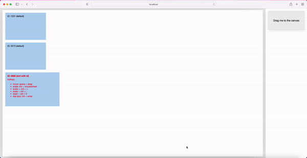

# Vue Draggable Panel

**Vue3** based drag panel component

---

## Demo

https://cainier.github.io/draggable-panel



## Example

https://github.com/Cainier/draggable-panel/blob/main/src/App.vue

## Features

1. Canvas scale
2. Canvas move
3. Chart item scale
4. Chart item resize

## Hotkey

> Ctrl can be replaced by Command

* **Move**: Space + Drag
* **Scale**: Ctrl + Mousewheel
* **Scale +**: Ctrl + =
* **Scale -**: Ctrl + -
* **Reset**: Ctrl + 0
* **Real Size**: Ctrl + Enter

## Installation

``` typescript
npm i draggable-panel

yarn add draggable-panel
```

## Document

### Props

* width: Number
    - Description: Panel width (px)
    - Required
    - Example: 1920
* height: Number
    - Description: Panel height (px)
    - Required
    - Example: 1080
* data: Objects in Array
    - Description: Chart data array
    - Required
    - Example:
      ```
      [
        ...
        {
          id    : 1,    // ID (Number / String)
          width : 300,  // Default width (Number)
          height: 200,  // Default height (Number)
          x     : 20,   // Default Y (Number)
          y     : 20    // Default X (Number)
        },
        ...
      ]
      ```
* chartMinWidth: Number
    - Description: Minimum chart width (px)
    - Default: 100
* chartMinHeight: Number
    - Description: Minimum chart height (px)
    - Default: 100
* padding: Number
    - Description: The default spacing between the canvas and the container (px)
    - Example: 32
* scaleMin: Number
    - Description: Canvas minimum scale ratio
    - Example: 0.5
* scaleMax: Number
    - Description: Canvas maximum scale ratio
    - Example: 10
* lock: Boolean
    - Description: Lock scale / move / resize
    - Example: false
* canvasStyle: Object
    - Description: Canvas custom style
    - Example:
      ``` json
      {
        "background": "#FFFFFF"
      }
      ```
* chartStyle: Object
    - Description: Chart custom style
    - Example:
      ``` json
      {
        "background": "#1976D255"
      }
      ```

### Events

* @canvas-scale -> function(scale)
    - Description: Emitted when canvas scale
    - Parameters:
        - scale: Number
            - Description: Scale ratio

* @canvas-drop -> function(event, position)
    - Description: Drag and drop element from outside the draggable-panel to the canvas
    - Parameters:
        - event: DragEvent
            - Description: DragEvent
        - position: Object
            - x: number
                - Description: Canvas position X
            - y: number
                - Description: Canvas position Y

* @chart-move -> function(chartItem)
    - Description: Emitted when canvas chart move
    - Parameters:
        - chartItem: Object
            - Description: Chart object in chart array

* @chart-scale -> function(chartItem)
    - Description: Emitted when canvas chart scale
    - Parameters:
        - chartItem: Object
            - Description: Chart object in chart array

### Slots

* chart
    - Description: Chart default item
    - Required
    - Example:
      ``` html
      <template #chart="{ chart, index }">
          <div>{{ chart }}</div>
      </template>
      ```

* chart-[id]
    - Description: Chart for specified ID
    - Example:
      ``` html
      <template #chart-1="{ chart, index }">
          <div>{{ chart }}</div>
      </template>

      <template #chart-2="{ chart, index }">
          <div>{{ chart }}</div>
      </template>
      ```

## Thanks For

* [js 实现以鼠标位置为中心滚轮缩放图片](https://juejin.cn/post/7009892447211749406)
* [vite打包lib库](https://juejin.cn/post/7073646687968821256)
* [ld7979](https://github.com/ld7979)
